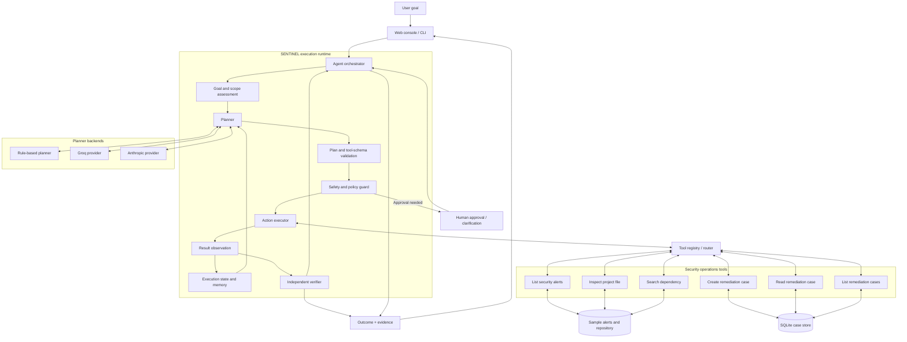
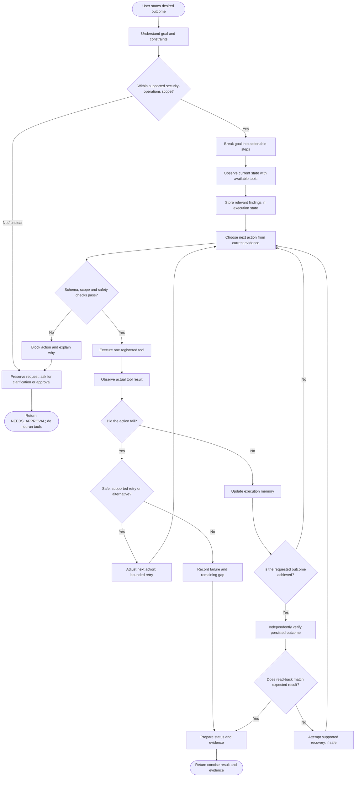

# SENTINEL
### Autonomous Security Operations & Remediation Worker

**Investigate. Act. Verify.**

[Live Demo]([https://example.com](https://centralign-ai-sentinel.onrender.com))


SENTINEL is a small AI task worker for security-alert investigation. It checks whether a flagged dependency is actually used in a sample project, gathers evidence, creates a remediation case when appropriate, and then reads the case back to confirm it was saved correctly.

SENTINEL is designed to show a complete, auditable workflow—not just a chatbot response. It records the actions it takes and the evidence behind its decisions.

---

## What can SENTINEL do?

SENTINEL currently focuses on one use case: **dependency security-alert triage** for a small Python/JavaScript-style repository.

It can:

- Read the available security alerts.
- Inspect supported project files without running project code.
- Search for dependency declarations and imports.
- Classify the evidence as `CONFIRMED`, `DOC_ONLY`, `NOT_FOUND`, or `INSUFFICIENT`.
- Create a remediation case only when the dependency is confirmed in a manifest.
- Read the case back and check that its details and evidence match.
- Recover from selected errors, with a limited number of retries.
- Ask for clarification instead of guessing when a request is unclear or outside its supported scope.

**Important:** SENTINEL does not determine whether a vulnerability is exploitable, and it does not automatically change project files.

## Quick start

You need **Python 3.12**. The application uses Python's standard library, so you do not need to install runtime packages.

### 1. Download and open the project

Extract the project ZIP, then open the extracted `sentinel` folder in your terminal or VS Code.

Make sure your terminal is in the folder that contains `app`, `data`, `tests`, and this `README.md`.

### 2. Create a virtual environment (recommended)

**Windows PowerShell**

```powershell
python -m venv .venv
.\.venv\Scripts\Activate.ps1
```

If PowerShell blocks activation, run this once in the same terminal, then activate again:

```powershell
Set-ExecutionPolicy -Scope Process -ExecutionPolicy Bypass
.\.venv\Scripts\Activate.ps1
```

**macOS / Linux**

```bash
python3 -m venv .venv
source .venv/bin/activate
```

### 3. Start the web console

```bash
python -m app.main serve
```

Open [http://127.0.0.1:8765](http://127.0.0.1:8765) in your browser.

To use another port:

```bash
python -m app.main serve --port 8765
```

To stop the app, press `Ctrl+C` in the terminal.

### 4. Try a sample task

Copy this into the task box:

> Investigate the critical dependency alert in this project. Check whether the affected package is used, create a remediation case with supporting evidence, and verify that the case was recorded.

You can also run a demo from the terminal:

```bash
python -m app.main demo 1
```

Other demos:

```bash
python -m app.main demo 2  # recovery
python -m app.main demo 3  # missing evidence
python -m app.main demo 4  # ambiguous request
python -m app.main demo 5  # approval required
```

## Run the tests

The test suite does not need API keys or internet access.

```bash
python -m unittest discover -s tests -t .
```

The project also supports running the tests with `pytest`. To install it:

```bash
python -m pip install -r requirements.txt
```

Then run:

```bash
python -m pytest
```

## How SENTINEL works

For each task, SENTINEL follows this process:

1. **Understand the request.** It identifies the goal and checks whether the request is within its supported security-operations scope.
2. **Choose an action.** The planner selects a tool based on the current task state.
3. **Check safety.** The guard validates the proposed action before it runs.
4. **Run the tool and inspect the result.** The agent updates its state using the tool's actual output.
5. **Recover when possible.** For selected failures, SENTINEL retries or tries another supported path. Retries are limited.
6. **Verify the outcome.** After creating a case, SENTINEL fetches it separately and compares its fields and evidence with what it intended to save.
7. **Report the result.** It returns `COMPLETED`, `PARTIALLY_COMPLETED`, `FAILED`, or `NEEDS_APPROVAL`.

`NEEDS_APPROVAL` can mean that a human must approve an action or clarify a request. The report identifies which is needed.


## Architecture

SENTINEL separates **planning** from **execution control**. The planner proposes the next action; the runtime validates it, checks policy, invokes the registered tool, records the result, and decides whether another step is needed.



### Component responsibilities

| Component | Responsibility |
|---|---|
| Interface | Accepts the goal and presents execution status, approval needs, and evidence |
| Orchestrator | Maintains the observe–decide–act loop and controls task progression |
| Planner | Selects a proposed next action using rules or a configured LLM provider |
| Validation and safety guard | Checks tool names, arguments, scope, and action policy before execution |
| Tool router | Dispatches only to explicitly registered tools |
| Tools | Read alerts and project evidence, search dependencies, and manage remediation cases |
| Execution memory | Carries relevant findings and action results between steps |
| SQLite store | Persists remediation cases locally |
| Independent verifier | Reads the created case through a separate operation and compares saved fields/evidence |
| Recovery logic | Handles selected failures with bounded retries or a supported alternative |

> **Control boundary:** an LLM can recommend an action, but it cannot directly execute arbitrary code or bypass the runtime's validation and safety checks.

## Autonomous execution workflow

The workflow is goal-driven: the user specifies the outcome, not every tool call. SENTINEL determines the next supported action from the current evidence and observed state.



### What “verified” means in SENTINEL

A successful tool response is not, by itself, proof of completion. For remediation-case creation, SENTINEL performs a separate read of the case and checks the saved details and supporting evidence. The final status reflects the observed and verified state—not merely the planner's intention.

### Evidence lifecycle

```mermaid
sequenceDiagram
    autonumber
    actor User
    participant Agent as SENTINEL runtime
    participant Tools as Registered tools
    participant Store as SQLite case store
    participant Verify as Independent verifier

    User->>Agent: State desired outcome
    Agent->>Tools: Read alert and inspect project evidence
    Tools-->>Agent: Findings and evidence
    Agent->>Agent: Update execution memory; select next action
    Agent->>Agent: Validate action and apply safety guard
    Agent->>Tools: Create remediation case (if justified)
    Tools->>Store: Persist case and evidence
    Store-->>Tools: Saved case reference
    Tools-->>Agent: Creation result
    Agent->>Verify: Fetch case independently
    Verify->>Store: Read saved case
    Store-->>Verify: Persisted fields and evidence
    Verify-->>Agent: Match / mismatch result
    Agent-->>User: Status, actions taken, and evidence
```

## Evaluator walkthrough

A reviewer can inspect the system without configuring an LLM key:

1. Start the local console using the Quick start instructions.
2. Submit the sample dependency-alert investigation goal.
3. Inspect the alert and repository evidence shown in the run.
4. Confirm that case creation is gated on dependency evidence and duplicate checking.
5. Open the resulting case list or run `python -m app.main cases`.
6. Run the recovery and approval-required demos to inspect non-happy-path behavior.
7. Run the unit test command to check the automated suite.

The default rule-based planner avoids external API cost. Groq and Anthropic are optional planner backends; provider tests are mocked, so live provider connectivity should be evaluated separately with the reviewer's own credentials.

## Safety and boundaries

- Project inspection is read-only. SENTINEL does not execute repository code.
- The sandbox restricts which files can be inspected.
- A remediation case can only be created after the dependency is confirmed in a manifest and a duplicate check is performed.
- Evidence in a case must come from tool results; the agent cannot invent evidence.
- Actions requiring approval are blocked until approval is provided.
- Source-code patching is not implemented.
- Requests outside the supported domain are kept as the user wrote them. SENTINEL asks for clarification and does not run tools for those requests.

## LLM providers and API costs

SENTINEL has three modes:

| Mode | Configuration | Cost |
|---|---|---|
| Rule-based (default) | No provider configuration required | No LLM API cost |
| Groq | Set `LLM_PROVIDER=groq` and `GROQ_API_KEY` | Depends on your Groq account and usage |
| Anthropic | Set `LLM_PROVIDER=anthropic` and `ANTHROPIC_API_KEY` | Depends on your Anthropic account and usage |

No API key is included with the project. You provide and pay for your own API usage.

### Use the default rule-based mode

No API key is needed:

```bash
python -m app.main demo 1
```

### Configure Groq or Anthropic

1. Copy `.env.example` to `.env`.
2. Open `.env` and set the provider and its API key.
3. Restart SENTINEL.

Example for Groq:

```env
LLM_PROVIDER=groq
GROQ_API_KEY=your_groq_api_key
```

Example for Anthropic:

```env
LLM_PROVIDER=anthropic
ANTHROPIC_API_KEY=your_anthropic_api_key
```

Keep `.env` private. **Do not commit it to GitHub or include it in a submission ZIP.** Use `.env.example` to show the required variable names without sharing secrets.

The LLM proposes tool calls. SENTINEL still checks each proposal with its schema validation and safety guard before executing it. The rule-based planner remains available with:

```bash
python -m app.main demo 1 --rules
```

Provider tests use mocked responses and do not need real API keys. Live Groq and Anthropic API calls have not been verified by the project author; a real key is needed to test those integrations against the providers.

## Useful commands

| Command | What it does |
|---|---|
| `python -m app.main serve` | Start the web console |
| `python -m app.main demo 1` | Run the successful demo |
| `python -m app.main demo 2` | Run the recovery demo |
| `python -m app.main demo 3` | Run the missing-evidence demo |
| `python -m app.main demo 4` | Run the ambiguous-request demo |
| `python -m app.main demo 5` | Run the approval-required demo |
| `python -m app.main cases` | List saved remediation cases |
| `python -m unittest discover -s tests -t .` | Run all tests |

For demo fault injection, the CLI also supports:

```bash
python -m app.main run "Investigate the critical dependency alert." --fault transient:2
```

Supported fault examples include `transient[:N]`, `write-then-fail`, and `tamper`.

## Web console

The console uses a warm beige-and-brown design. Use the theme control in the header to switch between light and dark modes. Your selection is saved in the browser. On the first visit, the console follows your system theme.

## Project structure

```text
app/
  agent/          Task interpretation, planning, safety and orchestration
  environment/    Sample repository and demo fault injection
  llm/            Provider interface, Groq and Anthropic integrations
  storage/        SQLite storage
  tools/          Tools available to the agent
  verification/   Independent case verification
  main.py         CLI entry point
  web.py          Web console
data/             Sample alerts and repository
tests/            Automated tests
```

## Known limitations

- The alerts and repository are sample data, not a live security feed.
- Scope detection uses keyword-based rules. Unusual wording may need clarification.
- Dependency detection covers common Python and JavaScript manifests and imports.
- Version comparison supports exact `==` pins against simple ranges only.
- SENTINEL does not assess exploitability or whether vulnerable code is reachable.
- The web console is intended as a local prototype and does not include user authentication.
- Provider integrations are tested with mocked responses; live provider calls have not been verified.

## Future improvements

Possible next steps include a live advisory feed, better dependency and lockfile analysis, a human approval workflow, safe patching in an isolated worktree, case updates and closing, and authentication for the web console.

## Design assumptions

This prototype is designed for one user running locally. It uses a sample alert feed, a sandbox repository, and a local SQLite case tracker. The alert's manifest path is treated as a hint to investigate, not as proof that the package is present.
